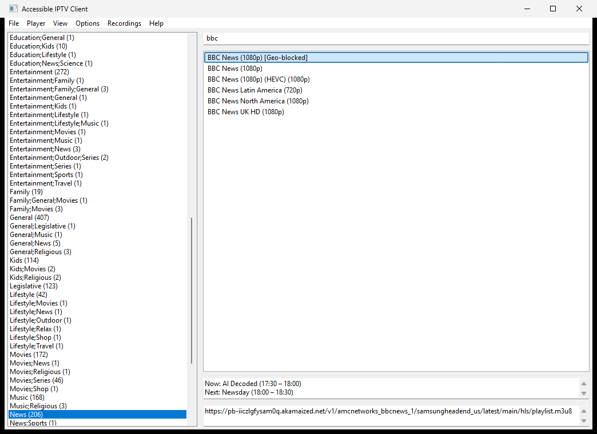
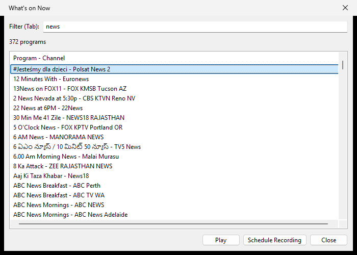
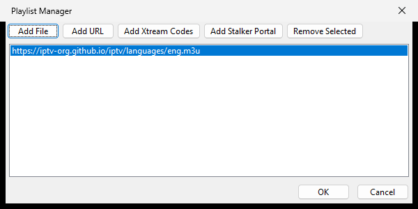

# Accessible IPTV Client

A vibe-coded, keyboard-first IPTV player for Windows and Linux, built to work well with screen readers and reliably load large playlists and EPGs.

[](https://t.me/SerrebiProjects)

**Questions, bugs, or release news?** Join the [SerrebiProjects Telegram group](https://t.me/SerrebiProjects), the fastest place to get help.

## Screenshots

The main window: playlist groups on the left, the channel list on the right, and the on-air episode description plus the optional stream URL for the selected channel underneath.


Typing in the filter box narrows the channel list as you type; the guide panel follows the selection.



**What's on Now** (in the EPG menu) lists everything airing across every channel, with its own filter box, and can play a programme's channel or schedule a recording.



The built-in player (libVLC) with keyboard-reachable controls, or hand the stream to an external player instead.


Sources are managed in the Playlist Manager (**Ctrl+M**), which takes M3U files, URLs, Xtream Codes logins, and Stalker Portal details.



## Features

- Screen reader friendly (NVDA, JAWS, Narrator, Orca).
- M3U/M3U+ playlists, Xtream Codes, and Stalker Portal sources.
- Built-in player (libVLC via python-vlc) or an external player (VLC, MPC-HC, MPV, etc.).
- Channel groups, fast channel search, and EPG search.
- Favorites: mark channels with **Ctrl+D** and reach them from the **Favorites** category at the top of the category list.
- A preferred audio track for the built-in player, under **Options > Preferred Audio Track** — pick an audio description track automatically wherever a channel offers one, or name the track/language you want.
- XMLTV EPG support (`.xml` and `.xml.gz`), including large multi-million-row guides.
- Catch-up/timeshift playback for channels that support it.
- Tab from the channel list reaches the on-air **episode description** for the highlighted channel, and Shift+Tab comes straight back to it. A **Show Stream URL** switch under **Options** puts the read-only stream-URL field one Tab further on; turn it off and the description is the last control before Tab wraps round.
- Account status under **File > Account Info** — expiry date, days remaining, trial flag and connection limits for Xtream Codes and Stalker Portal accounts, including accounts detected automatically from a playlist or stream URL.
- Casting support, plus optional system tray minimize.
- Recording and DVR scheduling, with an optional **Recordings > Shut Down the Computer When Recordings Finish** for overnight captures. The built-in player has its own **Record** button (**Ctrl+R**) for what you are watching, and **Schedule Recording** is on the context menu of every EPG programme.
- A built-in, offline **User Guide** under **Help > User Guide**. Press **F1** anywhere — on a menu item, in a dialog, in the built-in player or on a control in the main window — and it opens at the section about what you are using. It is a plain read-only document with a table of contents and Find, so it reads well with a screen reader.
- Multilingual interface (14 languages) with automatic OS-language detection and a manual selector under **Options > Language**.
- Built-in updater on Windows that verifies SHA-256 and Authenticode before applying an update, restarts the app by itself when the install finishes, and reports the result on the next start.

## Download and install

Grab the latest build from the [Releases page](https://github.com/serrebidev/Accessible-IPTV-Client/releases).

See the [changelog](CHANGELOG.md) for release-by-release changes.

**Windows installer (recommended)**

1. Download `AccessibleIPTVClient-Setup-vX.Y.Z.exe`.
2. Run it and approve the elevation prompt. It installs to Program Files, adds a Start Menu entry, and updates itself in place.

**Windows portable**

1. Download `AccessibleIPTVClient-vX.Y.Z.zip` (or `IPTVClient.zip`).
2. Extract it anywhere and run `IPTVClient.exe` — no installation required.

**Debian and Ubuntu (.deb)**

1. Download `accessible-iptv-client_X.Y.Z-1_all.deb`.
2. Install it with apt so the dependencies come along: `sudo apt install ./accessible-iptv-client_X.Y.Z-1_all.deb`
3. Start it from your desktop menu, or run `accessible-iptv-client`.

The package is architecture-independent and runs the app with the system Python, so apt supplies wxPython, python-vlc, the VLC plugins, and ffmpeg. It is built and install-tested on Debian 13 (trixie); other apt-based distributions work as long as they ship `python3-wxgtk4.0` and `python3-vlc`.

Casting is optional there, because Debian's `python3-pychromecast` is older than the app needs and pyatv is not packaged at all. Everything else works without them; to add casting:

```bash
pip3 install --user "pychromecast>=14" "async-upnp-client>=0.38" "pyatv>=0.14"
```

There is no built-in updater on Linux — install the next `.deb` over the current one. Where your data lands on Linux is existing app behaviour that the package does not change: `iptvclient.conf` and `scheduled_recordings.json` go in your home directory, while the EPG database (`epg.db`), the playlist cache, and the EPG debug log go in your temp directory — so an imported guide is cleared whenever `/tmp` is, typically at reboot. Point `TMPDIR` somewhere persistent before launching if you want the guide to survive.

**Other Linux**

No package yet — run it from source (below).

On Windows, installed builds keep your settings, EPG database, schedules, and cache in `%APPDATA%\AccessibleIPTVClient`. Portable builds keep the settings file (`iptvclient.conf`) next to `IPTVClient.exe` and fall back to the same `%APPDATA%` folder for everything else. Uninstalling leaves your data untouched.

## Run from source (Windows or Linux)

1. Install Python 3.11+.
2. Install dependencies: `pip install -r requirements.txt`
3. If you want the built-in player, install VLC 3.0+ (python-vlc loads libVLC from your VLC install).
4. Launch it: `python main.py`

## Keyboard shortcuts

### Anywhere

- **F1** — User Guide, opened at the section about the focused control, dialog or menu item

### Main window

- **Ctrl+M** — Playlist Manager
- **Ctrl+E** — EPG Manager
- **Ctrl+I** — Import EPG to database
- **Ctrl+Shift+A** — Account Info
- **Ctrl+D** — Add the selected channel to Favorites, or remove it
- **Ctrl+Shift+R** — Start recording the selected channel
- **Ctrl+Shift+D** — Show the catch-up download windows (Escape in a download window hides it; the download continues)
- **Ctrl+Q** — Exit
- **Enter** — Play selected channel
- **Context Menu / Apps key** — Channel options (including Catch-up if available). Closing the built-in player on a catch-up programme returns to that channel's catch-up list.

### Built-in player

- **Space** — Play/Pause
- **Up / Down** — Adjust volume (2% steps)
- **Ctrl+Up / Ctrl+Down** — Adjust volume (5% steps)
- **A** — Next audio track
- **F11** — Toggle fullscreen
- **Escape** — Exit fullscreen
- **Tab** — Navigate between controls

## Favorites

Press **Ctrl+D** on a channel to mark it, or use the context menu / **View > Add to Favorites**. Marked channels appear under **Favorites**, the second category in the category list, and are read out as "(Favorite)" elsewhere in the list. Favorites are stored in `iptvclient.conf` by provider and channel id, so they survive a playlist refresh; nothing about your account is stored with them.

## Preferred audio track

Channels that carry an audio description track usually start on the ordinary one, which means switching by hand on every channel. **Options > Preferred Audio Track** fixes that:

- **Prefer an audio description track when the channel has one** matches the wording providers actually use, in several languages ("audio description", "AD", "Audiodeskription", "Hörfilm", and so on).
- The text field takes your own track names or languages, most wanted first, separated by commas.
- A track you pick in the player menu is remembered automatically - there is no separate pin option.

A track you pick by hand is remembered **for that channel** and comes back the next time you open it, ahead of every other rule including the audio-description checkbox — so a channel where you want the Polish track keeps the Polish track, while every other channel still starts on its audio description. The memory keeps the track's **position** as well as its name, so a provider renaming or renumbering its tracks between connections does not lose your choice. The last track you picked anywhere is the fallback for channels you have never chosen one for. The choice is re-applied after a reconnect, and the **Choose Audio Track** control you reach with Tab always reads out the track that is actually playing. Press **A** in the player to cycle tracks as before.

Recordings follow the same choice. An MP3, or any other audio-only recording, holds a single audio track, so before it starts the app asks the stream which tracks it carries and keeps the one you would hear: the track playing in the built-in player when it is showing that channel, otherwise the track remembered for the channel, then the audio-description preference and your preferred tracks. An audio description track is recognised by the flag broadcasters put on it even when its name says nothing. Video recordings keep every audio track and mark that one as the default. This covers recordings started from the list or the player, scheduled recordings and catch-up downloads.

## Shutting down after recordings

**Recordings > Shut Down the Computer When Recordings Finish** powers the machine off once every running and scheduled recording is done, which is what you want for a late-night capture. It never fires while something is still recording or waiting in the schedule, it shows a 60-second countdown you can cancel first, and it turns itself off once it has been used or canceled, so it can never surprise you twice.

## EPG notes

- During EPG import, a detailed log is written to `iptvclient_epg_debug.log` — in `%APPDATA%\AccessibleIPTVClient` on Windows, or your system temp directory elsewhere.
- `.xml.gz` guides are supported and go through a safe download/verify workflow.

## Built-in player buffering

The internal player sizes its network buffer dynamically. You can tune it in `iptvclient.conf`:

- `internal_player_buffer_seconds` (default ~2s)
- `internal_player_max_buffer_seconds` (default ~18s)
- `internal_player_variant_max_mbps` (HLS quality cap in Mbps, 0 = no cap)

Lower values start faster; higher values are more tolerant of jitter.

## Languages and translations

The interface is translatable with GNU gettext. By default the app follows your OS language and falls back to English; override this under **Options > Language**. The choice is saved to `iptvclient.conf` (`language`) and applies fully after a restart.

Bundled languages: English, Spanish, Arabic, Portuguese (Brazilian), French, German, Russian, Turkish, Italian, Polish, Hindi, Chinese (Simplified), Japanese, and Hungarian. Most were produced with AI assistance and have not yet been reviewed by native speakers, so wording may be imperfect.

**Found a translation mistake, or want a language added?** Please [open an issue](https://github.com/serrebidev/Accessible-IPTV-Client/issues) or contact the maintainer with your fixes and they will be added. New languages are welcome too — human-translated, AI-translated (just ask and they can be generated), or submitted by anyone. Every release keeps all catalogues in sync automatically, so corrections and additions ship in the next build.

Translations live in `locale/<lang>/LC_MESSAGES/iptvclient.po`. The tooling is pure Python — no GNU gettext, Babel, or polib required:

```bash
python tools/i18n_tools.py extract   # refresh locale/iptvclient.pot from the source
python tools/i18n_tools.py update    # merge new strings into every .po (keeps translations)
python tools/i18n_tools.py compile   # compile every .po -> .mo
```

To contribute a new language:

1. Run `python tools/i18n_tools.py update` (or copy `locale/iptvclient.pot`) to create `locale/<code>/LC_MESSAGES/iptvclient.po`, then translate the `msgstr` lines.
2. Run `python tools/i18n_tools.py compile`.
3. Add `(code, "Native name")` to `_LANGUAGE_LABELS` in `i18n.py` so it appears in the menu.
4. Open a pull request. Keep every `{placeholder}` exactly as it appears in the English source.

The User Guide is translated separately from the interface: it lives in `docs/help/<lang>.md`, one Markdown file per language, with English (`en.md`) as the reference and the fallback. To translate it, copy `en.md` to your language code, translate the text and keep every `{#topic-id}` exactly as it is — F1 help opens sections by those ids. A section you leave out falls back to the English one. The notes at the top of `en.md` explain the rest.

Hungarian translation and screen-reader testing contributed by the community (see issue [#2](https://github.com/serrebidev/Accessible-IPTV-Client/issues/2)).

## Building

See [`BUILD.md`](BUILD.md) for the full release pipeline — PyInstaller packaging, Authenticode signing, and the Program Files installer.

```bat
build.bat build       # build the app
build.bat dry-run     # preview the next version bump and release notes
build.bat release     # bump version, build, sign, zip, tag, push, and create a GitHub Release
```

Release prerequisites: `gh` CLI authenticated (`gh auth login`), and a code signing certificate installed with `signtool.exe` available (or set `SIGNTOOL_PATH`).

## Contributing

Pull requests are welcome. If Accessible IPTV Client has been useful to you, open a PR with a fix or feature and I'll review it.

## Community and support

Report bugs and request features in [Issues](https://github.com/serrebidev/Accessible-IPTV-Client/issues). For questions, feedback, and release news, join the [SerrebiProjects Telegram group](https://t.me/SerrebiProjects).
